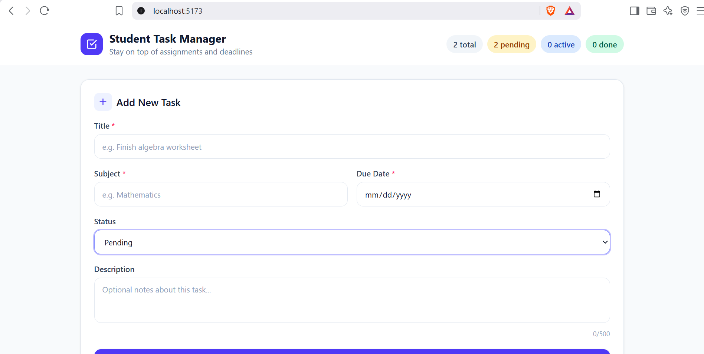
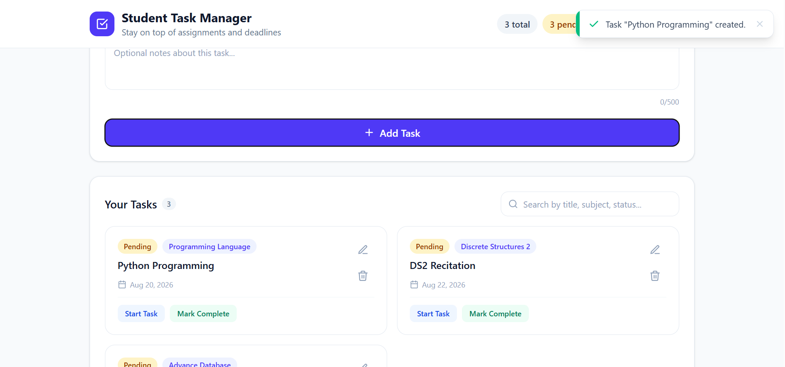
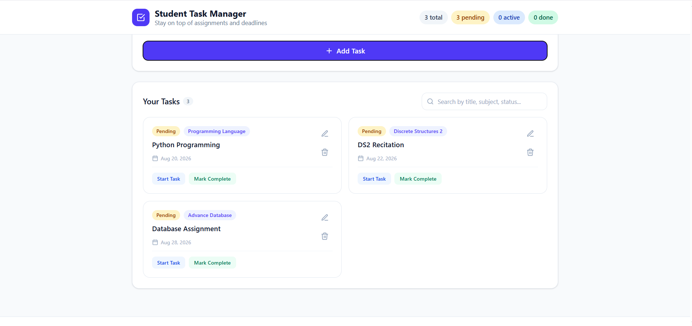
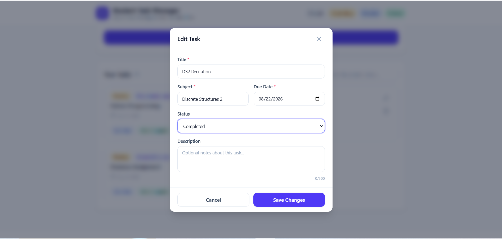
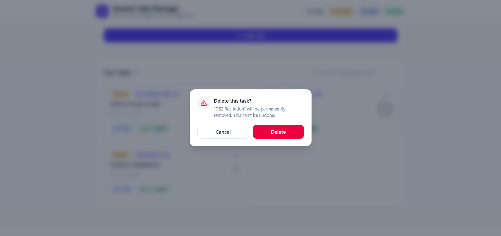
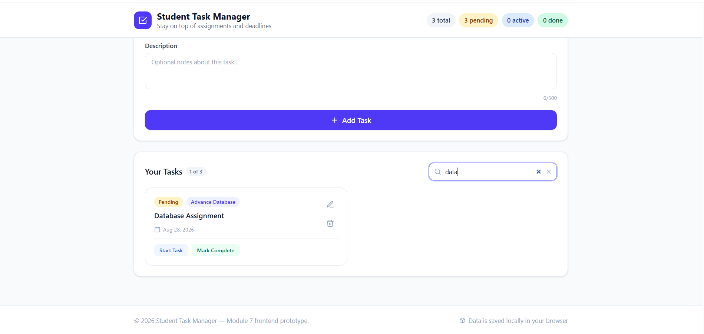
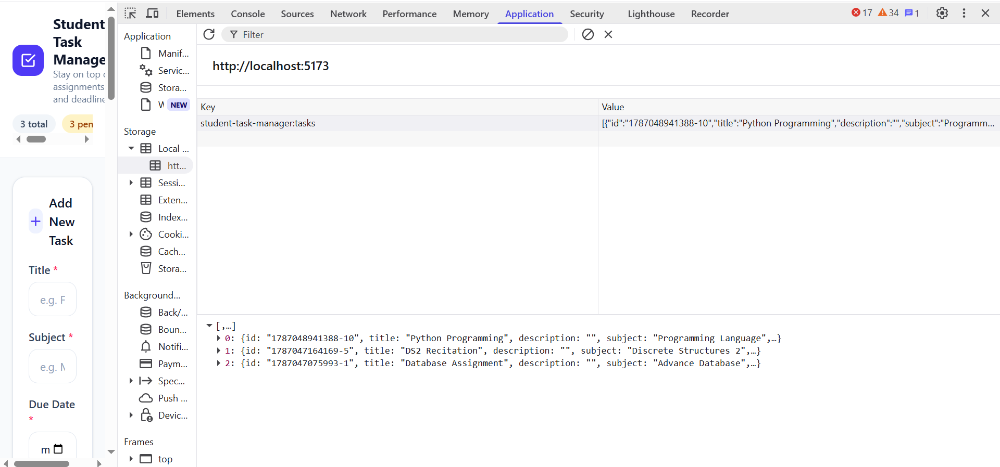
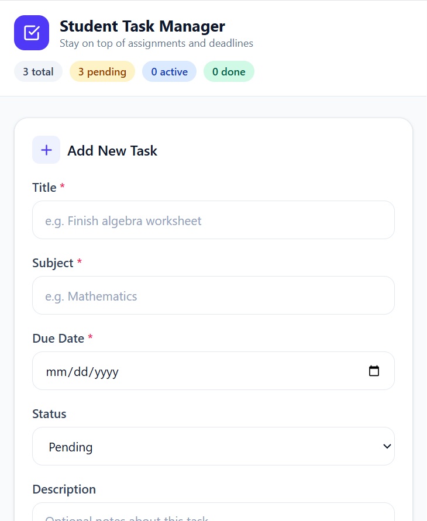

# Student Task Management System

## Student Information

* **Student Name:** Justine S. David
* **Course and Section:** BSCS-3A
* **Subject:** Software Engineering 1


## System Description

The **Student Task Management System** is a web-based application designed to help students organize and manage their academic tasks, assignments, and deadlines. It allows students to create, view, update, delete, and search tasks through a simple and responsive interface.

The selected entity from **Module 6** is the **Task** entity.

## Implemented Features

* Create new tasks
* View task records
* Edit existing tasks
* Delete tasks with confirmation
* Search and filter tasks
* Form validation for required fields
* Task status management

  * Pending
  * In Progress
  * Completed
* Task count indicators
* Success and error feedback
* Persistent data using browser `localStorage`
* Responsive user interface
* Reusable Vue.js components

## Technologies Used

* **Vue.js** – Frontend framework
* **Vite** – Development and build tool
* **Tailwind CSS v4** – User interface styling
* **JavaScript** – Application logic
* **localStorage** – Browser-based data persistence
* **Git** – Version control
* **GitHub** – Repository hosting
* **GitHub Actions** – Automated build checking

## Installation and Run Instructions

### 1. Clone the repository

```bash
git clone https://github.com/ToshiVario15/david-module7-vue-system.git
```

### 2. Navigate to the project folder

```bash
cd david-module7-vue-system
```

### 3. Install dependencies

```bash
npm install
```

### 4. Start the development server

```bash
npm run dev
```

### 5. Open the application

Open the local URL provided by Vite, usually:

```text
http://localhost:5173
```

### 6. Build the application

To test the production build:

```bash
npm run build
```

## localStorage

The application uses the browser's **localStorage** to save task records. When a task is created, updated, or deleted, the application updates the stored task data.

The saved records are loaded again when the application starts, allowing tasks to remain available even after refreshing the browser.

The application uses localStorage because Module 7 focuses on implementing the frontend prototype. A backend database is not required for this module.

## Connection Between Module 6 and Module 7

In **Module 6**, the Student Task Management System was designed using a three-tier architecture:

```text
Presentation Layer
        ↓
     Vue.js
        ↓
Application Layer
        ↓
 Node.js + Express
        ↓
   Data Layer
        ↓
MongoDB Atlas Free
```

For **Module 7**, the **Task** entity selected from the Module 6 system was implemented as a working Vue.js frontend prototype.

The Module 7 implementation uses:

```text
Vue.js
   ↓
JavaScript Application Logic
   ↓
localStorage
```

The Node.js/Express backend and MongoDB Atlas Free database remain part of the proposed architecture and can be implemented as future improvements.

## Application Screenshots

### Running Application



### Adding a Task



### Task List



### Editing a Task



### Delete Confirmation



### Search Function



### localStorage



### Responsive View



## Known Limitations

* Data is stored only in the user's browser using localStorage.
* Tasks are not synchronized between different devices or browsers.
* There is no user authentication.
* There is no backend API.
* MongoDB Atlas is not connected in the current prototype.
* The system does not currently provide online notifications or reminders.

## Proposed Future Improvements

Future versions of the system may include:

* Node.js and Express backend
* MongoDB Atlas database integration
* User authentication and accounts
* Synchronization across devices
* Task reminders and notifications
* Advanced filtering and sorting
* Calendar-based task management
* Task priority levels
* Improved reporting and progress tracking

## Project Status

This project represents the current **Module 7 Vue.js implementation** of the Student Task Management System. Further improvements and backend integration may be developed in future versions.
